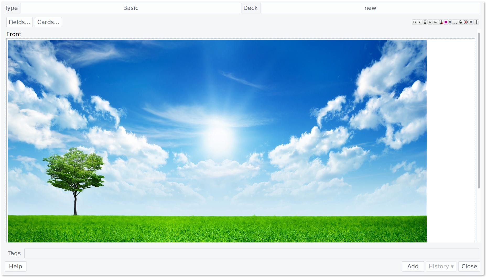
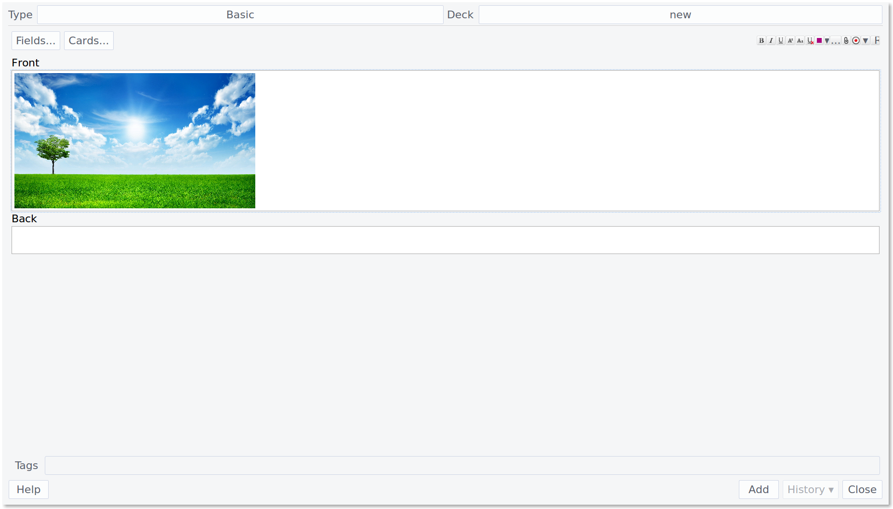
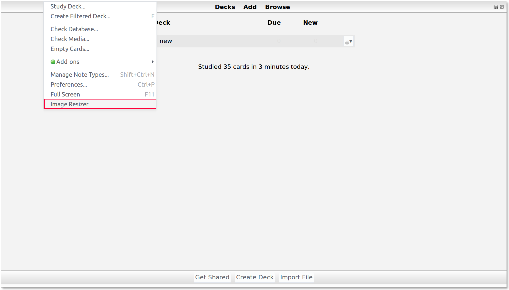
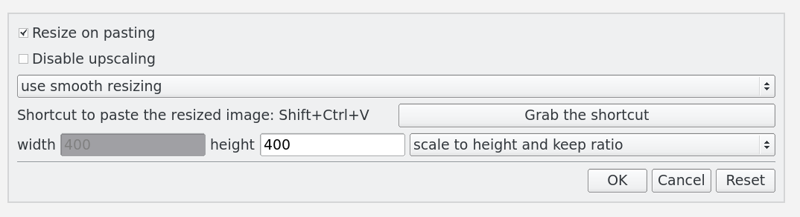

# ImageResizer
Download on [AnkiWeb](https://ankiweb.net/shared/info/1214357311) or with add-on number 1214357311.

Having issues, want to contribute or want to give feedback? See the [contributing page](CONTRIBUTING.md).

Want to see a history of the add-on changes? See the [history page](HISTORY.md).

#### Introduction

ImageResizer is a simple Anki add-on used to resize images, automatically or on command.
Sometimes images are too big or small for the screen when reviewing.
This add-on gives you the power to define an image size in advance and paste images onto cards with those dimensions!
It can be configured to automatically resize every image you paste or it can be assigned a keyboard shortcut so you can resize sometimes but not others.

What does this add-on **NOT** do? It does not change the size of images that are already in cards, it only applies to new images that are pasted. It also doesn't let you click and drag to change the size of an image. If you'd like to do that, check out the [Resize image in editor](https://ankiweb.net/shared/info/1103084694) add-on.

#### Without ImageResizer

#### With ImageResizer

## Usage

Install ImageResizer, and that's it! (Well, maybe restart Anki just to be sure.)
Images will be automatically resized on pasting or drag-and-dropping.

#### Settings

You can change the keyboard shortcut, size of the image and other settings by selecting `Tools -> Image Resizer` from the top menu bar.

The **Settings** window will pop up.

1. Check `Resize on pasting` so that images will be resized automatically. Uncheck it if you only want images to be resized when pressing the shortcut.
2. Check `Disable upscaling` if you only want to make images smaller.
3. Smooth transformation may produce a higher quality image, but may also take a longer time than the fast transformation. Choose the one that suits you.
4. You can also set the shortcut to paste the resized images, it's `Ctrl + Shift + V` by default.
5. You can set the width or height of the resized image.
If you select `scale to width and keep ratio`, ImageResizer will resize the image according to the width you specified,
and the height value here will be ignored. The same goes to `scale to height and keep ratio`.
Notice that it will always keep the original image's ratio, either by width or height.
There's also a third option, `scale to the maximum dimension and keep ratio`.
If this option is chosen, ImageResizer will scale to width if width > height,
and will scale to height if height > width.
This option is useful when the ratio of height/width of the image is extreme.
