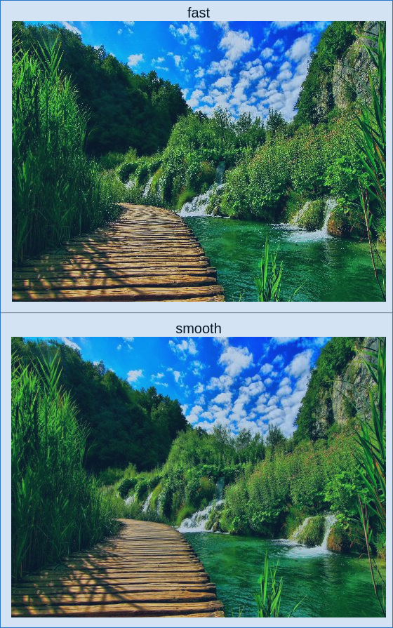

# ImageResizer
An Anki add-on used to resize images, automatically or on command! Download on [AnkiWeb](https://ankiweb.net/shared/info/1214357311) or with add-on number 1214357311.

Have feedback or contributions? See the [contributing page](CONTRIBUTING.md).

<ul>
<li><b>Update 1</b>: Add reset and log. Feb 8, 2016</li>
<li><b>Update 2</b>: Now you can copy the image files and paste it without opening them. Dropping works too. <i>svg</i> files work now. Feb 10, 2016</li>
<li><b>Update 3</b>: Make the resize work on Mac. Feb 13, 2016</li>
<li><b>Update 4</b>: Thanks to <a href="https://github.com/Glutanimate" rel="nofollow">Glutanimate</a>, scaling without turning on PNG pasting works now. Feb 18, 2016</li>
<li><b>Update 5</b>: Add another scaling option: scale to the maximum dimension and keep ratio. If width &gt; height, it will scale to width, if width &lt; height, it will scale to height. It would be useful if the width/height ratio of the image is extremely small(or large) April 20, 2017</li>
<li><b>Update 6</b>: Add an option to disable upscaling for small images. June 9, 2017</li>
<li><b>Update 7</b>: Fix the encoding/decoding error. July 23, 2017</li>
<li><b>Update 8</b>: Thanks to <a href="https://github.com/ChrisK91" rel="nofollow">ChrisK91</a>, the smooth transformation is added. Dec 17, 2017</li>
<li><b>Update 9</b>: support files with uppercased extensions</li>
<li><b>Update 10</b>: A big thanks to <a href="https://github.com/lgaborini" rel="nofollow">lgaborini</a> for porting ImageResizer to Anki2.1. Jul 25, 2018</li>
<li><b>Update 11</b>: Fix the encoding issue in Anki 2.1. Sep 10, 2018</li>
<li><b>Update 12</b>: No functional change to the add-on. It now has a new maintainer and <a href="https://github.com/mankinence/ImageResizer" rel="nofollow">location on GitHub</a>. A big thanks to <a href="https://github.com/searene" rel="nofollow">searene</a> for creating this add-on! April 23, 2020</li>
</ul>

#### Introduction

ImageResizer is a simple Anki add-on used to resize images, automatically or on command.
Sometimes images are too big or small for the screen when reviewing.
This add-on gives you the power to define an image size in advance and paste images onto cards with those dimensions!
It can be configured to automatically resize every image you paste or it can be assigned a keyboard shortcut so you can resize sometimes but not others.
This add-on does NOT change the size of images that are already in cards, it only applies to new images.

#### Before resizing

#### After resizing

## Usage

Install ImageResizer, and that's it! Images will be automatically resized on pasting or drag-and-dropping.

#### Settings

You can change the keyboard shortcut, size of the image and other settings by selecting `Tools -> Image Resizer` from the top menu bar.

The <b>Settings</b> window will pop up.

1. Check `Resize on pasting` so that images will be resized automatically. Uncheck it if you only want images to be resized when pressing the shortcut.
2. Check `Disable upscaling` if you only want to make images smaller.
3. Smooth transformation may produce a higher quality image, but may also take a longer time than the fast transformation. Choose the one that suits you.
4. You can also set the shortcut to paste the resized images, it's <i>Ctrl + Shift + v</i> by default.
5. You can set the width or height of the resized image.
If you select `scale to width and keep ratio`, ImageResizer will resize the image according to the width you specified,
and the height value here will be ignored. The same goes to `scale to height and keep ratio`.
Notice that it will always keep the original image's ratio, either by width or height.
There's also a third option, `scale to the maximum dimension and keep ratio`.
If this option is chosen, ImageResizer will scale to width if width > height,
and will scale to height if height > width.
This option is useful when the ratio of height/width of the image is extreme.

#### Common Issues

###### Blurry images
If you aren't satisfied with the quality of the image after its resized, try changing your Settings (see the above section for specific instructions.)
Make sure you have `use smooth transformation` set, this makes the paste slower but higher quality.
If you pasted a small image that was made bigger and became blurry even with `use smooth transformation` set,
you may just need to use the original image size, see the next Common Issue below.

###### Small images are being made bigger
If you don't want small images to be made bigger, check the `Disable upscaling` box in the Settings menu.
See the Settings section above for how to access the Settings menu.
